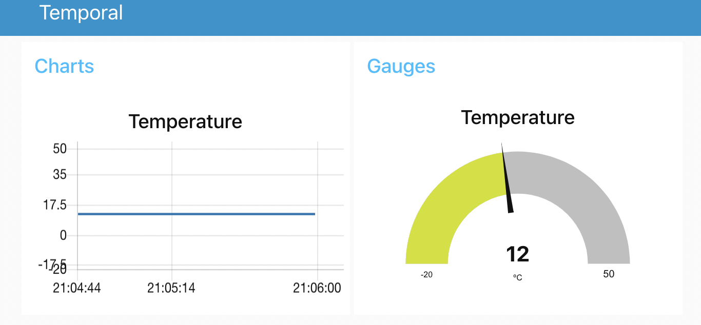

# Kubeedge-Nodered-Docker

Project for running Node-RED in Docker


### Starting development Environment

A docker-compose file starts the development environment including a Mosquitto instalation for testing the data provided by devices.

```
docker-compose up

docker-compose down

docker-compose rm -v
```


### Application description

The implemented flows includes a dashboard that allows to visualize several measures notfified using MQTT.




### CI/CD Process

THis respository also includes the required files for creating the docker image (**Dockerfile**) with the application to be deployed in the runtime environment.

The workflow definition (**.gitlab-ci.yml**)

### Health endpoints

When running containers within a managed cloud environment, it is often useful to provide some endpoints within the container, so the cloud management system can verify the container is still alive and responding to requests.

This project adds the Health Checking capability from [CloudNativeJS.io](https://www.cloudnativejs.io).  The integration has be done in the **server.js** file by adding the following lines of code:

```JavaScript
var health = require('@cloudnative/health-connect');

var healthcheck = new health.HealthChecker();
app.use('/live', health.LivenessEndpoint(healthcheck));
app.use('/ready', health.ReadinessEndpoint(healthcheck));
app.use('/health', health.HealthEndpoint(healthcheck));
```

### CI

File .gitlab-ci contains the description of the CI part. In this case generate the docker image and publishing it.